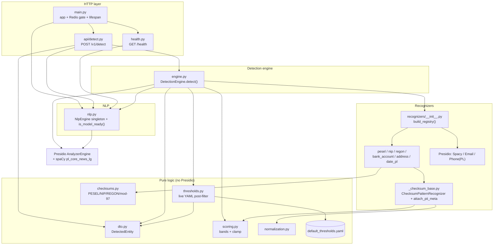
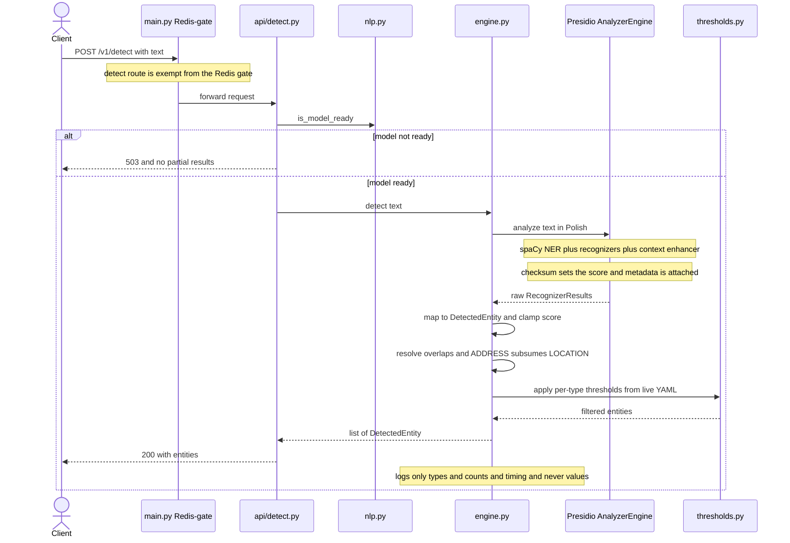
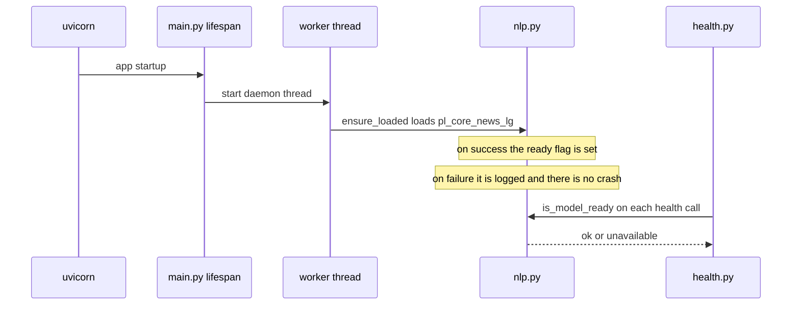

# ADR 0001 — PII Detection Engine Architecture (Epic 2)

- **Status:** Accepted
- **Date:** 2026-06-16
- **Deciders:** Project author (thesis), with the project constitution as the binding authority
- **Scope:** `apps/gateway-api` — the Polish PII **detection** layer
- **Related:** `specs/002-pii-detection-engine/` (spec, plan, research D1–D8, contracts), constitution `.specify/memory/constitution.md`

---

## 1. Context

The gateway must find personally identifiable information (PII) in Polish civil-law contract text
before any later epic substitutes or proxies it. Epic 2 delivers **detection only**: given a string,
return a list of entities — type, character offsets, an explainable confidence score, the exact matched
text, and type-specific metadata. Nothing is substituted, stored, logged, or sent to an LLM.

Constraints that shaped the design:

- **Stack is fixed** (constitution): Python 3.12 / FastAPI, Microsoft **Presidio** + spaCy
  **`pl_core_news_lg`**. No alternatives.
- **Polish only**; **recall over precision** (better to over-detect than miss real PII);
  **no PII in logs**; **deterministic, explainable** scoring (the thesis must describe scoring as a
  method, not hand-picked numbers); **simplicity over completeness** with documented limitations.
- Must extend the **existing** Epic 1 runtime (the `/health` surface and the Redis-availability gate)
  without breaking it.

This ADR records **how** the detection system works, the **dependency/communication** between its
files, and **why** it is built this way.

---

## 2. Decision (summary)

Wrap Presidio behind a single **`DetectionEngine.detect(text) -> list[DetectedEntity]`** — the only entry
point. Presidio's base recognizers (via the spaCy model) cover PERSON / LOCATION / EMAIL_ADDRESS /
PHONE_NUMBER; everything Poland-specific (PESEL, NIP, REGON, bank account, postal address, Polish dates)
is a **custom recognizer in its own module**. Scoring is a fixed rule set (base → checksum → context
bonus → clamp). Per-type confidence thresholds are applied as a **post-filter** read live from a YAML
file. A thin **`POST /v1/detect`** endpoint exposes the engine; the existing `/health` surface reports
real spaCy-model readiness.

The component boundaries deliberately separate **pure logic** (checksums, normalization, scoring,
thresholds, DTO — no Presidio import, instantly unit-testable) from the **Presidio-bound** parts
(NLP engine, recognizers, analyzer assembly).

---

## 3. How the detection system works

### 3.1 The pipeline (one `detect()` call)

```text
text ─▶ AnalyzerEngine.analyze(pl)
          ├─ spaCy NlpEngine: tokenize/lemmatize + NER (NKJP labels → Presidio types)
          ├─ recognizers produce candidate RecognizerResults
          │    • SpacyRecognizer  → PERSON / LOCATION / DATE_TIME (from NER)
          │    • Email / Phone(PL) → EMAIL_ADDRESS / PHONE_NUMBER
          │    • custom (regex)    → PESEL / NIP / REGON / bank / address / PL-date
          │        └─ ChecksumPatternRecognizer sets the score from the checksum
          │           (valid → high band, invalid → low band, KEPT) + attaches metadata
          └─ LemmaContextAwareEnhancer: +fixed bonus when a context label is nearby
        ─▶ map RecognizerResult → DetectedEntity   (text = input[start:end]; clamp score ≤ 0.99)
        ─▶ resolve_overlaps()    (longest/containing span wins; ADDRESS subsumes contained LOCATION)
        ─▶ apply_thresholds()    (drop entity if score < per-type threshold; YAML, read live)
        ─▶ sort by offset, log types/counts/timing (never values) ─▶ list[DetectedEntity]
```

### 3.2 Layers & responsibilities

| Layer | Files | Responsibility |
|-------|-------|----------------|
| HTTP | `main.py`, `api/detect.py`, `health.py` | Routing, the Redis gate (with `/v1/detect` exemption), model-readiness 503, health readiness, startup model load |
| Engine | `detection/engine.py` | Build/own the `AnalyzerEngine`; orchestrate analyze → DTO → overlap → threshold; the single `detect()` entry point |
| NLP | `detection/nlp.py` | Singleton spaCy `NlpEngine` + NKJP→Presidio label mapping + `is_model_ready()` |
| Recognizers | `recognizers/__init__.py` + per-recognizer modules + `_checksum_base.py` | Produce candidate spans; checksum-driven scoring; context words; metadata |
| Pure logic | `checksums.py`, `normalization.py`, `scoring.py`, `dto.py`, `thresholds.py`, `default_thresholds.yaml` | No Presidio import — checksum math, separator stripping, score bands/clamp, the output DTO, threshold loading/filtering |
| Config | `config.py` | Optional `DETECTION_THRESHOLDS_PATH` (path only; values read live, not via cached Settings) |

### 3.3 Startup & readiness (separate from a request)

At app startup a background thread loads the (image-baked) spaCy model and flips an `is_model_ready()`
flag. `/health` reports that flag as the `spacy_model` dependency (`ok`/`unavailable` → overall
`degraded`); `/v1/detect` returns **503** until ready. The model is also lazily loaded on first
`detect()` if startup load hasn't completed, so the engine is usable in isolation.

---

## 4. Dependency & communication diagrams

### 4.1 Module dependency graph (who imports whom)



### 4.2 Request sequence — `POST /v1/detect`



### 4.3 Startup / readiness sequence



---

## 5. Why it works this way (rationale)

Each choice traces to a constitution principle or a verified Presidio behaviour (research D1–D8).

### 5.1 Single `DetectionEngine` facade returning a project DTO (D1, D7)
A `DetectedEntity` dataclass/Pydantic model at the engine boundary decouples the rest of the system from
Presidio internals and gives a `metadata` channel that `RecognizerResult` lacks (PESEL gender, REGON
variant, IBAN/NRB format). Later epics depend on this stable shape, not on Presidio.

### 5.2 NKJP → Presidio label mapping is mandatory (D2)
`pl_core_news_lg` emits NKJP labels (`persName`, `placeName`, `geogName`, `date`), **not** the English
labels Presidio maps by default. Without an explicit `model_to_presidio_entity_mapping`, PERSON/LOCATION
detect **nothing** — the single most likely integration bug. The mapping in `nlp.py` is the fix.

### 5.3 Checksum scoring bypasses `validate_result` (D3) — the key non-obvious decision
Presidio's `PatternRecognizer.validate_result()` returning `False` sets the score to `MIN_SCORE` and the
result is then **dropped**. That directly violates the requirement that a bad-checksum value be
**surfaced at low confidence, not dropped** (recall over precision). So `ChecksumPatternRecognizer`
instead runs the regex via the base class and **assigns the score explicitly** — valid → high band,
invalid → low band — keeping both. This is why checksum logic lives in an overridden `analyze()`, not in
`validate_result()`.

### 5.4 Overlap resolution is our own pass, not `ConflictResolutionStrategy` (D4)
`ConflictResolutionStrategy.MERGE_SIMILAR_OR_CONTAINED` is an **anonymizer**-side concept and merges only
*same*-type spans. The spec's overlaps are **cross-type** (NIP⊂PESEL, REGON-9⊂REGON-14, city⊂address).
`AnalyzerEngine.analyze()` returns raw overlapping results (it removes only low scores), so a small
deterministic pass — longest/containing span wins, with ADDRESS explicitly subsuming a contained
LOCATION — gives a clean, explainable, score-independent result. (A model LOCATION can outscore the
address; the length rule still keeps the address.)

### 5.5 Per-type thresholds as a live-reloaded post-filter (D5, clarification 2026-06-16)
`analyze()` accepts only one global `score_threshold`, so per-type minimums are applied **after** analysis.
The thresholds live in a **dedicated YAML file**, separate from the env-based (cached) `Settings`, read
with an mtime check so an edit applies on the **next request without a restart**. Storing them in Redis
was rejected — it would re-couple the deliberately stateless detect path to Redis.

### 5.6 Deterministic bands + clamp to ≤ 0.99 (D6)
Scores come from constants (`S_VALID`, `S_INVALID`, address/date bases) plus a fixed context bonus from
`LemmaContextAwareEnhancer` (`min_score_with_context_similarity = 0.0` disables the default floor so a
label near a bad-checksum value only nudges it). Clamping to **0.99** reserves `1.0` so a configured
threshold of `1.0` reliably **disables** a type, and makes "valid + labelled ≈ 0.99" exact. This is what
lets the thesis describe scoring as a consistent method.

### 5.7 Lazy + eager model load, O(1) readiness (D8)
The model load is heavy and must not happen per request, so it is a process singleton. Eager background
loading at startup lets `/health` report **real** readiness within its < 500 ms budget (a flag read, not
an inference) and `/v1/detect` 503 until ready; lazy load on first `detect()` keeps the engine usable in
isolation (and in tests).

### 5.8 Detect route exempt from the Redis gate (spec clarification)
Detection has no Redis dependency, so gating it on Redis (Epic 1's blanket rule) would make a pure-compute
feature fail when Redis is down. The route is exempt and gated only on the model — each route is gated on
the dependencies it actually uses.

### 5.9 Pure-logic / Presidio split
`checksums.py`, `normalization.py`, `scoring.py`, `thresholds.py`, `dto.py` import no Presidio. This makes
the thesis-distinctive logic (checksums, scoring) fast and trivial to unit-test, and confines the heavy
spaCy/Presidio dependency to `nlp.py`, the recognizers, and `engine.py`.

---

## 6. Consequences

**Positive**
- One clear entry point (`detect()`); recognizers are independently unit-testable (no model needed for
  regex/checksum tests). Test suite: 84 tests, ~90% coverage.
- Explainable, deterministic, tunable scoring; recall-first defaults; bad-checksum values preserved.
- Health honestly reflects model readiness; detection survives a Redis outage.
- Adding a recognizer = one module + register it in `build_registry()`.

**Negative / limitations** (documented per Constitution IX, see `apps/gateway-api/README.md`)
- Worded-date coverage is limited to the common `day month(genitive) year [r.]` pattern.
- `pl_core_news_lg` may miss rare/foreign or inflected names (model limitation). When the model's `date`
  span and the custom date span overlap, the longer wins and the custom `kind` metadata can be lost.
- Over-detection by design (a random digit string passing a checksum is surfaced).
- PESEL/REGON with separators are matched only in contiguous form; NIP/bank separators are handled.
- The image must bake in the model; behind a TLS-inspecting proxy the build needs the corporate CA
  (`CA_CERT_FILE`). Presidio's email recognizer may attempt a one-time TLD-list fetch (falls back offline).

---

## 7. Alternatives considered

| Alternative | Rejected because |
|-------------|------------------|
| Raw spaCy + hand-rolled regex (no Presidio) | Reinvents the recognizer registry, context enhancer, and result model; contradicts the fixed stack. |
| `validate_result()` for checksums | `False` drops the match — violates "surface bad checksum at low confidence". |
| Anonymizer `ConflictResolutionStrategy` for overlaps | Anonymizer-only and same-type only; cannot express cross-type containment. |
| Thresholds in env `Settings` | Cached (`@lru_cache`), so changes need a restart — fails "no restart". |
| Thresholds in Redis | Re-introduces a Redis dependency on the stateless detect path. |
| Synchronous blocking model load at startup | Delays `/health` availability and blocks the event loop. |
| Transformer NER | Not the mandated stack; heavier with no benefit at thesis scale. |

---

## 8. References

- Spec & design: `specs/002-pii-detection-engine/{spec,plan,research,data-model}.md`, `contracts/`
- Constitution: `.specify/memory/constitution.md` (principles II, VI, VIII, IX especially)
- Code: `apps/gateway-api/gateway_api/detection/`, `gateway_api/api/detect.py`
- Presidio docs verified during design: `PatternRecognizer` scoring, `LemmaContextAwareEnhancer`,
  `NlpEngineProvider`, `ConflictResolutionStrategy` (anonymizer)
