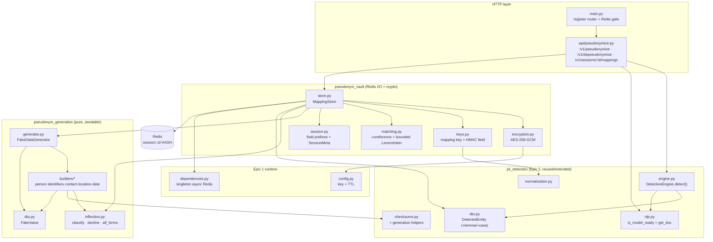
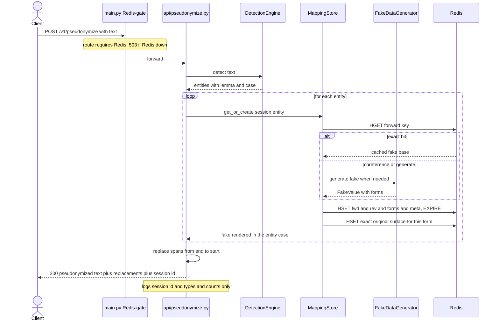
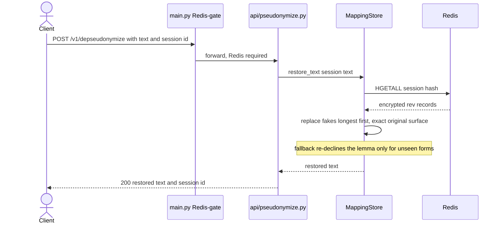

# ADR 0002 — Substitution & Reversible Session Mapping Architecture (Epic 3)

- **Status:** Accepted
- **Date:** 2026-06-17
- **Deciders:** Project author (thesis), with the project constitution as the binding authority
- **Scope:** `apps/gateway-api` — the realistic fake-data **generation** + reversible, encrypted **session mapping** layer
- **Related:** `specs/003-fake-data-generator/` (spec + clarifications 2026-06-16, plan, research D1–D9, data-model, contracts), constitution `.specify/memory/constitution.md` (**v1.1.0**), ADR 0001 (Epic 2 detection)
- **Amended by:** **ADR 0003** (2026-06-17) — the internal `pseudonym_vault/` structure was refactored for readability (module renames + `MappingStore` decomposed into a thin facade + collaborators). Every decision, rationale, and wire contract below is **unchanged**; the file/node names in §3.4 and §4.1 describe the pre-refactor layout (see ADR 0003 §4 for the current one).

---

## 1. Context

Epic 2 (ADR 0001) **detects** PII and returns `DetectedEntity` objects. Epic 3 is the next pipeline
stage: given detected entities, **substitute** each with a realistic Polish synthetic value and **remember
the original↔fake mapping reversibly** within a session, so a later turn (and the Epic 4 LLM proxy) can
de-pseudonymize. It sits between detection and the (future) LLM Adapter and calls **no LLM** itself.

Constraints that shaped the design:

- **Stack is fixed** (constitution): Python 3.12 / FastAPI, **Faker `pl_PL`**, **Redis + AES-256**.
- **Reversibility within a session** (Principle III): bidirectional mapping, encrypted at rest, key never
  exposed, per-session TTL.
- **Realistic substitution** (Principle VII): no `[PERSON_1]`-style tokens; checksum-valid identifiers;
  gender-consistent names.
- **No PII in logs** (Principle VIII); **Polish first** (Principle VI); **simplicity over completeness**
  with documented limitations (Principle IX).
- Must **reuse** Epic 2's `DetectionEngine` (not reimplement) and Epic 1's singleton async Redis client,
  `Settings`, and the Redis-availability gate.

Two spec clarifications (2026-06-16) and one **constitution amendment (v1.1.0)** are load-bearing here and
are recorded in §5.

> Note: as part of this epic the Epic 2 package was renamed `detection/` → **`pii_detection/`** (domain
> naming, ahead of `pseudonym_generation` + `pseudonym_vault`). Path references in ADR 0001 predate the
> rename.

---

## 2. Decision (summary)

Two new internal packages plus two thin debug routes, mirroring Epic 2's **pure-logic / I-O split**:

- **`pseudonym_generation/`** (pure, stateless, seed-deterministic) — `FakeDataGenerator.generate(entity)
  -> FakeValue` over Faker `pl_PL`, with per-type builders (checksum-valid PESEL/NIP/REGON/bank,
  gender-consistent names, ±10y dates) and a pure **suffix-table inflection** engine for PERSON/LOCATION.
- **`pseudonym_vault/`** (all Redis I/O + crypto) — `MappingStore` over **one AES-256-GCM-encrypted Redis
  HASH per session**, with per-type mapping keys, **HMAC forward index**, coreference, collision handling
  and a sliding TTL.
- **`api/pseudonymize.py`** — `POST /v1/pseudonymize`, `POST /v1/depseudonymize`,
  `GET /v1/sessions/{id}/mappings`. All three **require Redis** (subject to the Epic 1 gate; not exempt).

Epic 2 is **extended, not frozen**: `DetectedEntity` gains optional `lemma`/`case`, filled for
PERSON/LOCATION from the spaCy token, so substitution can be case-aware.

**Encryption scope (ratified, constitution v1.1.0):** only **original PII** is AES-256-GCM encrypted;
synthetic fakes are stored in clear as the **reverse index**, and forward field names are a **keyed HMAC**
of the normalized original. No real PII is readable without the key.

---

## 3. How the system works

### 3.1 Inbound pipeline — `POST /v1/pseudonymize` (no LLM)

```text
text + session_id? ─▶ Redis gate (503 if Redis down)  ─▶  model-ready? (503 if not)
   ─▶ DetectionEngine.detect(text)            # Epic 2; PERSON/LOCATION carry lemma + case
   ─▶ for each entity:  MappingStore.get_or_create(session, entity)
            ├─ exact forward hit  → render cached fake in the entity's case
            ├─ coreference (PERSON/LOCATION): same-type full-lemma containment
            │        • exactly one match → reuse, project onto the matching fake token(s)
            │        • cannot align (e.g. hyphen-split) → mint a fresh DISTINCT fake
            │        • two or more matches → new person (never guess)
            └─ else generate (collision-safe: retry ×3 → per-type fallback)
       ↳ write fwd:{hmac}=enc(fake_base), forms:{fake_base}, rev:{form} per case, meta
       ↳ record the EXACT original surface for the form actually inserted (literal restore)
   ─▶ replace spans end→start (offsets stay valid)  ─▶  sliding TTL refresh
   ─▶ {pseudonymized_text, entities_replaced[], session_id}     # logs: session_id + types/counts only
```

### 3.2 Outbound pipeline — `POST /v1/depseudonymize`

```text
text + session_id ─▶ Redis gate ─▶ MappingStore.restore_text(session, text)
   ─▶ HGETALL → collect rev:{fake_form} records
   ─▶ replace fake forms with originals, LONGEST-FIRST, word-boundary aware
          • exact rev record → literal original surface  (captured at substitution time)
          • else fallback: re-decline the lemma to the form's case (for unseen forms)
   ─▶ {restored_text, session_id}
```

### 3.3 Encrypted Redis HASH per session (`session:{id}`)

```text
field name                         field value (decrypted)                    encrypted?
─────────────────────────────────  ─────────────────────────────────────────  ──────────
fwd:{HMAC_SHA256(key, type|key)}   fake_base                                   ✅ value
rev:{fake_form}                    {orig_base|surface, case, entity_type,      ✅ value
                                    exact?}      (one per inflected fake form)
forms:{fake_base}                  {case: fake_form, …}                        ✅ value
corefs                             [{lemma, fake_base, entity_type}, …]        ✅ value
meta                               {created_at, last_activity, entity_count}   ✅ value
```
PII appears **only inside encrypted values**. Field names are a non-reversible HMAC (forward) or the
synthetic fake form (reverse) — both safe in clear. One `EXPIRE` governs the whole session; `DEL` clears
it atomically; `HGETALL` lists it.

### 3.4 Layers & responsibilities

| Layer | Files | Responsibility |
|-------|-------|----------------|
| HTTP | `main.py`, `api/pseudonymize.py` | Register routes (Redis-gated, not exempt); model-ready 503; thin orchestration; no-PII logging |
| Store (I/O) | `pseudonym_vault/store.py` | `get_or_create` / `get_original` / `get_all_mappings` / `delete_session` / `extend_ttl` / `restore_text`; sliding TTL |
| Crypto/keys | `pseudonym_vault/{encryption,keys,session}.py` | AES-256-GCM envelope; per-type mapping key + HMAC field name; field prefixes + meta |
| Matching | `pseudonym_vault/matching.py` | Coreference (lemma containment, token alignment) + bounded Levenshtein |
| Generation (pure) | `pseudonym_generation/{generator,dto}.py` + `builders/*` | `FakeValue`; per-type builders; seedable Faker dispatch |
| Inflection (pure) | `pseudonym_generation/inflection.py` | classify / decline / all_forms over fixed suffix tables |
| Epic 2 reuse/extend | `pii_detection/{engine,nlp,dto,checksums}.py` | `DetectedEntity.lemma/case` + morphology enrichment; checksum **generation** helpers |
| Config/runtime | `config.py`, `dependencies.py` | `REDIS_ENCRYPTION_KEY` (32 B), `redis_session_ttl=1800`; singleton async Redis client |

---

## 4. Dependency & communication diagrams

### 4.1 Module dependency graph (who imports whom)



### 4.2 Request sequence — `POST /v1/pseudonymize`



### 4.3 Request sequence — `POST /v1/depseudonymize`



---

## 5. Why it works this way (rationale)

Each choice traces to a constitution principle, a research decision (D1–D9), or an empirical fix found in
testing.

### 5.1 Two packages, pure / I-O split (mirrors Epic 2)
`pseudonym_generation/` imports no Redis and no crypto — it is a pure function of `(entity, seed)`, so
generators and inflection unit-test instantly and reproducibly. All Redis and AES live in
`pseudonym_vault/`. This keeps the thesis-distinctive logic (checksum generation, Polish inflection) fast
to test and confines the I/O.

### 5.2 Reuse `DetectionEngine`; extend the DTO with `lemma`/`case` (D1)
Case-aware substitution needs the original's **base form** and **grammatical case**. `pl_core_news_lg`
already provides both, so the engine fills `DetectedEntity.lemma/case` for PERSON/LOCATION (others stay
`None`) — **no second NLP dependency**. The enrichment degrades silently if the model is unavailable
(keeps Epic 2's faked-analyzer tests green).

### 5.3 Inflection is **generate-only**, by fixed suffix tables (D2)
The hard direction (arbitrary surface → lemma+case) is delegated to spaCy. We only ever **generate** forms
from a *known base + classified pattern*, which fixed suffix tables handle for the common patterns
(`-ski/-ska`, consonant masculine incl. fleeting-e, `-a` feminine, common cities). Rare/foreign/
indeclinable → base form. No `morfeusz`/LLM dependency (Principle IX). This is the documented limitation.

### 5.4 AES-256-GCM, and **encrypt originals only** (D3, D4, constitution **v1.1.0**)
The store is bidirectional, but **you cannot look up a value by its randomized ciphertext**. So: original
PII is AES-256-GCM encrypted (fresh 96-bit nonce, `nonce‖ct‖tag`); the **synthetic fake** — which is not
personal data — is stored in clear as the **reverse index**; the **forward** index is a **keyed
HMAC-SHA256** of the normalized original (non-reversible, and resists offline dictionary attack on small
domains like a PESEL). Fernet (AES-128) was rejected. This required a constitution clarification — Principle
III now states explicitly that synthetic substitutes and HMAC indexes need not be encrypted (**v1.1.0**,
resolving analysis finding C1).

### 5.5 One Redis HASH per session, sliding TTL, Redis-gated routes (D5)
A single hash gives **atomic** lifecycle: one `EXPIRE` (default 1800 s, refreshed on every op), `DEL`
clears all mappings at once (FR-010), `HGETALL` lists all (FR-011). Per-mapping keys were rejected (no
atomic clear/expire, more round-trips). Because the substitution path genuinely needs Redis, the routes
are **not** added to the Epic 1 gate's exempt set — they 503 when Redis is down, by design (contrast Epic
2's stateless `/v1/detect`, which is exempt).

### 5.6 Consistency: mapping key, coreference, ambiguity, collisions (D6, D7)
Mapping key is per-type (lemma for names; digits-only for identifiers — so separator variants collapse;
case-folded text otherwise — so the same literal under two types stays distinct). Coreference reuses a fake
when a new name's lemma is contained in a stored same-type name (full name ↔ surname-only), but an
**ambiguous** surname (≥2 stored matches) becomes a **new person** — never a guess (clarification Q2).
Generation is collision-checked (retry ×3 → per-type fallback; names re-roll, never gain a digit).

### 5.7 **Literal restore via captured exact surface** — the key reliability decision (test-driven)
Originally restore re-declined the original's lemma to the fake form's case. Testing a real contract showed
this is **gender-blind**: a woman's consonant surname ("Anną Nowak") does not decline, but the re-declension
produced "Anną Nowakiem" — a broken round-trip. Fix: at substitution time we **record the exact original
surface** for the form actually inserted, so restore is **literal** and correct regardless of declension
quality or gender. Re-declension remains only as a fallback for forms never seen (e.g. an LLM-introduced
inflection in Epic 4). This makes reversibility robust — the security-critical guarantee.

### 5.8 Declinable post-filter + distinct-fake-on-no-alignment (test-driven)
Two further fixes came from stress tests: (a) fake **cities are post-filtered to a declinable pattern**
(like surnames), so a substituted city renders in the right case and round-trips — an indeclinable pick
(e.g. `-ice` plurals) otherwise lost case info; (b) when a coreference **cannot be aligned to a token**
(e.g. a hyphen-split surname "Kowalczyk-Wąsowicz"), the store **mints a fresh distinct fake** instead of
reusing the full name's fake — reusing it caused two originals to share one fake → an index collision that
broke restore. Both have regression tests.

### 5.9 Generators reuse Epic 2 checksums; identifiers stay deterministic
PESEL/NIP/REGON/bank fakes are built with **generation helpers added to `pii_detection/checksums.py`**, so
generation and validation share one source of truth (a fake passes the same `*_is_valid` the detector
uses). PESEL preserves the original's gender + post-2000 offset; REGON preserves the 9-/14-digit variant.
Dates use a uniform **±10-year** shift (no birth-vs-non-birth classification — D9). PERSON gender is
**random** (no name↔PESEL association — documented).

### 5.10 Reviewer listing as a debug endpoint (analysis remediation U1)
`get_all_mappings` is reconstructed from the `forms` index (not from a `nom`-cased rev), so it is complete
even when a fake is indeclinable; it is surfaced at `GET /v1/sessions/{id}/mappings` so a reviewer has a
real runtime entry point. The pairs are returned to the caller but never logged.

---

## 6. Consequences

**Positive**
- **Exact reversible round-trip** verified on long Polish contracts and on rare/foreign/hyphenated names
  (restore is literal). Same original → same fake across all grammatical cases within a session.
- Realistic, **checksum-valid** identifiers; gender-preserving PESEL; REGON variant preserved; ±10y dates.
- Originals **AES-256-GCM encrypted** at rest; key never logged/returned; atomic clear/list/expire.
- Pure generation/inflection unit-test with no Redis and no model; store tests use `fakeredis`. Test suite:
  **150 tests** (3 model-only tests skip off-image).
- Adding a fake type = one builder + a dispatch entry; the store is type-agnostic.

**Negative / limitations** (documented per Principle IX, see `apps/gateway-api/README.md`)
- **Random fake gender** does not agree with the surrounding sentence ("Pan Anita", "Stawiła się Cezary").
- Inflection covers common patterns only; **multi-word/hyphenated cities** ("Stalowa Wola",
  "Skarżysko-Kamienna") inflect approximately in the forward direction (restore stays literal).
- **Foreign / diacritic names**: detected and reversible, but cross-case *consistency* depends on spaCy
  lemmatisation (foreign oblique forms are rarely reduced to a base) and oblique forms are occasionally
  mistyped (PERSON vs LOCATION). Rare *Polish* surnames work well.
- **Hyphenated surnames** are detected inconsistently by spaCy (Epic 2 boundary); substitution may be
  inconsistent but is now reversible (§5.8).
- Redis restart loses the session (acceptable recovery). No LLM yet — the Adapter/proxy is Epic 4.

---

## 7. Alternatives considered

| Alternative | Rejected because |
|-------------|------------------|
| Encrypt both sides / deterministic encryption of fakes | Bidirectional lookup over randomized ciphertext is impossible; deterministic AEAD is weaker and more complex. Clear synthetic fakes + HMAC index is simpler and leaks no real PII (D4, v1.1.0). |
| Fernet (AES-128) | Violates the mandated **AES-256**. |
| One Redis key per mapping | No atomic clear/expire; many round-trips for listing; can't express "any activity refreshes the *session*". |
| Re-decline the original's lemma on restore | Gender-blind — breaks female consonant surnames; replaced by capturing the exact original surface (§5.7). |
| Reuse the full fake for an unalignable partial mention | Two originals share one fake → index collision → broken restore; mint a distinct fake instead (§5.8). |
| Stateful generator that tracks used values | Couples generation to a session and breaks seed reproducibility; the store owns collision-freeness. |
| `morfeusz2` / local-LLM detection now | Higher cost / non-determinism / packaging; deferred to a possible future augmentation layer (local Ollama only — never cloud, to keep raw PII in-system). |

---

## 8. References

- Spec & design: `specs/003-fake-data-generator/{spec,plan,research,data-model}.md`, `contracts/`
  (pseudonymize.openapi, mapping-store, generators, inflection, encryption)
- Constitution **v1.1.0**: `.specify/memory/constitution.md` (Principle III amended — encryption scope;
  also I, VI, VII, VIII, IX)
- Code: `apps/gateway-api/gateway_api/pseudonym_generation/`, `gateway_api/pseudonym_vault/`,
  `gateway_api/api/pseudonymize.py`; extended `gateway_api/pii_detection/{dto,engine,nlp,checksums}.py`
- Prior art: **ADR 0001** (Epic 2 detection) — this layer consumes its `DetectedEntity`
- Postman collection for manual validation: `postman/pw-masters-secure-gateway.postman_collection.json`
