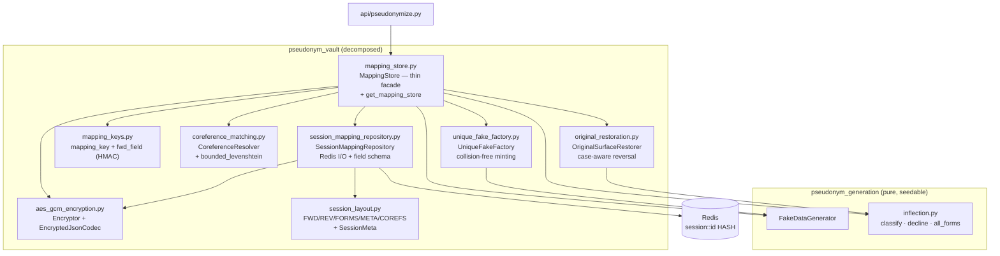

# ADR 0003 — Vault Readability Refactor: Module Decomposition & Naming Conventions

- **Status:** Accepted
- **Date:** 2026-06-17
- **Deciders:** Project author (thesis), with the project constitution as the binding authority
- **Scope:** `apps/gateway-api` — a behavior-preserving readability refactor of `gateway_api/`, concentrated in `pseudonym_vault/`
- **Relationship:** **Amends / refines ADR 0002** — refactors the *internal* structure of the substitution & reversible-mapping layer. It does **not** supersede 0002: every decision, rationale, and wire contract in 0002 still holds.
- **Related:** `specs/004-code-readability-refactor/` (spec + clarifications 2026-06-17, plan, research D1–D6, data-model, `contracts/preserved-interfaces.md`, quickstart, tasks), ADR 0002 (the architecture refined here), constitution `.specify/memory/constitution.md` (**v1.1.0**), `.claude/rules/python-naming-conventions.md`

---

## 1. Context

A code-readability review of the `apps/gateway-api` backend (the Epic 3 code from ADR 0002) raised three
concerns:

1. **Generic file names** in `pseudonym_vault/` (`encryption.py`, `matching.py`, `store.py`, `keys.py`,
   `session.py`) that reveal nothing about their role.
2. **Abbreviated identifiers** across the whole package (`hkey`, `mkey`, `fwd`, `_enc`, `_gen`, `blob`,
   `rec`, `ob`, single-letter loop variables, the Levenshtein `cur/prev/cset/sset/idxs`…) that force the
   reader to decode intent instead of reading it.
3. **`store.py` was too big** — one ~363-line `MappingStore` class with ~20 methods mixing ≥5 concerns
   (encryption helpers, Redis persistence, coreference, collision-safe generation, restoration, metadata).

The review also asked for the conventions to be captured as a **reusable rule for AI coding agents** so
future generated code follows the same standard.

This was framed explicitly as a **pure refactor**: the existing test suite plus the Redis field layout and
the AES-256-GCM envelope are the regression contract. No behavior, API, or wire-format change is permitted.

---

## 2. Decision (summary)

- **Rename the five vault modules to role-revealing names** (public class names `MappingStore` and
  `Encryptor` stay — they are part of the ADR 0002 / spec 003 contract and the test imports):

  | Before | After | Reason |
  |--------|-------|--------|
  | `store.py` | `mapping_store.py` | mirrors the dominant class `MappingStore` |
  | `encryption.py` | `aes_gcm_encryption.py` | names *which* scheme, not just "encryption" |
  | `matching.py` | `coreference_matching.py` | the dominant domain is name coreference |
  | `keys.py` | `mapping_keys.py` | mapping keys + HMAC forward field names |
  | `session.py` | `session_layout.py` | Redis HASH field layout + `SessionMeta` |

- **Decompose `MappingStore` by responsibility** into a thin orchestration facade plus five focused
  collaborators (each a concept already present in the ADR 0002 / data-model design):

  | Responsibility | Type / module |
  |----------------|---------------|
  | Encrypted-JSON (de)serialization | `EncryptedJsonCodec` (in `aes_gcm_encryption.py`) — wraps `Encryptor` |
  | Redis HASH persistence + field schema | `SessionMappingRepository` (`session_mapping_repository.py`) — sole owner of `redis`, the codec, and the `fwd:/rev:/forms:/meta/corefs` prefixes |
  | Coreference decision (name reuse) | `CoreferenceResolver` (in `coreference_matching.py`) — pure 0/1/≥2 rule + token alignment |
  | Collision-free fake minting | `UniqueFakeFactory` (`unique_fake_factory.py`) — retry ×3 → deterministic fallback |
  | Case-aware original restoration | `OriginalSurfaceRestorer` (`original_restoration.py`) — pure inflection |
  | Session API / orchestration | `MappingStore` (`mapping_store.py`) — thin facade delegating to the above |

- **Expand all identifiers** to full, intention-revealing names across the entire `gateway_api` package
  (deepest in the vault; lighter touch in `pii_detection/`, `pseudonym_generation/`, `api/`, top level).

- **Capture the conventions as an auto-loaded agent rule** at `.claude/rules/python-naming-conventions.md`
  (path-scoped to `apps/gateway-api/**/*.py`).

- **Opportunistic cleanups** in the facade: removed the `hkey.split(":", 1)[1]` session-id hack (the
  repository now owns `session_id`); hoisted the function-local `import re` / `from datetime import datetime`
  to module top.

---

## 3. What changed — and the regression contract

### 3.1 Internal structure (changed)

`pseudonym_vault/` went from 6 files (455 LOC, with a 363-line god-class) to 9 cohesive modules. Each new
unit has a single nameable responsibility and can be read in isolation.

### 3.2 What did NOT change — the frozen contract (the point of a pure refactor)

This is the reassurance for any reviewer: **every architectural decision in ADR 0002 is intact.**

- **Public Python API:** `MappingStore(redis, encryptor, key_bytes, ttl, generator)` (positional, used by
  the tests) and all method signatures (`get_or_create`, `get_original`, `get_all_mappings`,
  `restore_text`, `delete_session`, `extend_ttl`), plus `Encryptor` and `get_mapping_store`.
- **HTTP routes:** `POST /v1/pseudonymize`, `POST /v1/depseudonymize`, `GET /v1/sessions/{id}/mappings`
  — paths, models, and status codes unchanged.
- **Redis wire format:** the per-session HASH schema (`fwd:{hmac}`, `rev:{fake_form}`, `forms:{fake_base}`,
  `corefs`, `meta`) is byte-identical; stored JSON keys (`orig_base`, `case`, `entity_type`, `exact`,
  `lemma`, `fake_base`) are unchanged. A session written before the refactor stays readable after it — no
  migration.
- **Encryption:** AES-256-GCM, `nonce(12) ‖ ct ‖ tag`, originals-only; HMAC-SHA256 forward field naming
  (ADR 0002 §5.4, constitution v1.1.0). `EncryptedJsonCodec` is a rename of the old `_seal`/`_open`
  helpers over the **same** `Encryptor`.
- **Behavior:** every coreference / collision / literal-restore decision (ADR 0002 §5.6–§5.8) is preserved.

**Evidence:** the full suite — **150 passed, 3 skipped** — passes with **no assertion edits** (only import
paths and renamed test files). A live `POST /v1/pseudonymize` → `POST /v1/depseudonymize` round-trip on the
rebuilt image restored a Polish PII sentence byte-for-byte, with `/health` green (`redis: ok`,
`spacy_model: ok`). See `specs/004-code-readability-refactor/contracts/preserved-interfaces.md`.

---

## 4. Dependency diagram — `pseudonym_vault/` after the refactor

This is the §4.1 view of ADR 0002 redrawn for the new internal structure. The decision graph *outside* the
vault (api → engine, generation packages) is unchanged.

---

## 5. Why it works this way (rationale)

### 5.1 Decompose by domain, not by line count
The split mirrors concepts already named in the ADR 0002 design (codec, persistence, coreference,
collision-free minting, restoration) rather than mechanically chopping at N lines. Each module is a
concept a reviewer already holds, so the structure documents itself. The `SessionMappingRepository` is
the load-bearing extraction: the Redis field-schema knowledge that was smeared across ~10 `MappingStore`
methods now has one owner, which is also the single audit point for Constitution III/VIII.

### 5.2 Role-revealing file names; keep contractual class names
File names are the cheapest documentation layer. `aes_gcm_encryption` says *which* scheme;
`coreference_matching` names the domain. Class names `MappingStore`/`Encryptor` stay because they are
cited in the ADR 0002 / spec 003 contracts and in test imports — renaming them is a large blast radius for
no readability gain the file rename does not already deliver.

### 5.3 Full identifiers so comments become unnecessary
Intention-revealing names (`session_key` not `hkey`, `forward_field_name` not `fwd`, `current_row` not
`cur`) let the code read as prose. Remaining comments explain *why* (research references, the literal-restore
note), never *what* (Constitution IX — self-documenting code reduces the maintenance burden).

### 5.4 Agent rule in `.claude/rules/` (not `docs/`)
The convention is encoded as `.claude/rules/python-naming-conventions.md`, which Claude Code **auto-loads
into agent context** at session start (verified against the official memory docs), path-scoped via
`paths:` frontmatter to the backend Python tree so it costs context only when an agent edits that code. A
`docs/` file would not auto-load and would rely on a human remembering to cite it — defeating the goal of a
durable rule for future agents.

### 5.5 Naming is review-enforced
`ruff` is configured for `E/F/UP/B/SIM/I`; `pep8-naming` (`N`) is **not** enabled, and even if it were it
checks *casing*, not *abbreviation*. So the rule is a standard a reviewer (or agent) applies, not a linter
gate. Enabling `N` later is a possible additive follow-up.

---

## 6. Consequences

**Positive**
- Each vault module has one nameable responsibility and is understandable in isolation; the file tree
  documents the structure.
- The Redis field-schema knowledge has a single owner (`SessionMappingRepository`) — a cleaner audit point
  for the encryption/no-PII-in-logs guarantees.
- Identifiers are self-documenting across `gateway_api`; a durable, auto-loaded naming rule guides future
  agents.
- Zero behavior change: 150/150 tests pass unedited; live round-trip verified; no data migration.

**Negative / limitations** (documented per Constitution IX)
- Two modules exceed the soft ~150-line guideline: `mapping_store.py` (~279) and
  `session_mapping_repository.py` (~206). Both are single-responsibility; the counts are inflated by
  88-column formatting wrap and preserved *why*-docstrings. Kept cohesive rather than fragmented further.
- More files and one extra indirection (facade → collaborators) — the deliberate trade for cohesion and
  testability. The spec's threshold was explicitly a *soft* guideline (split by cohesion, not a hard line).
- Naming compliance is not lint-enforced (§5.5) — it relies on review and the agent rule.

---

## 7. Alternatives considered

| Alternative | Rejected because |
|-------------|------------------|
| **Edit ADR 0002 in place** | ADRs are immutable records of a decision at a point in time. This refactor is a *new* decision (structure/readability), not a reversal — so a new ADR that *amends* 0002 is correct; 0002 keeps only a one-line forward pointer. |
| **Mechanical split by line count** | Produces incohesive fragments; the user explicitly asked for a by-domain split. |
| **Rename the public classes too** (e.g. `MappingStore` → `SessionPseudonymStore`) | Breaks the published contract and every test for no gain the file rename doesn't already give. |
| **Keep persistence inline, extract only pure helpers** | Leaves the Redis field-schema duplication (the core readability problem) and weakens the III/VIII audit seam. |
| **Put the naming rule in `docs/` + a `CLAUDE.md` link** | Not auto-loaded into agent context; the rule would depend on a human citing it. |
| **Add `pep8-naming` (`N`) to enforce naming** | Checks casing, not abbreviation/length — would not flag `hkey`/`d`; review-based enforcement stands (possible additive follow-up). |

---

## 8. References

- Spec & design: `specs/004-code-readability-refactor/{spec,plan,research,data-model}.md`,
  `contracts/preserved-interfaces.md`, `quickstart.md`, `tasks.md`
- Constitution **v1.1.0**: `.specify/memory/constitution.md` (esp. III reversibility/encryption scope,
  VIII no-PII-in-logs, IX simplicity)
- Agent rule: `.claude/rules/python-naming-conventions.md`
- Code: `apps/gateway-api/gateway_api/pseudonym_vault/` (renamed + decomposed),
  identifier sweep across `pii_detection/`, `pseudonym_generation/`, `api/`, top-level modules
- Prior art: **ADR 0002** (the substitution & reversible-mapping architecture this refines), **ADR 0001**
  (Epic 2 detection — unaffected)
