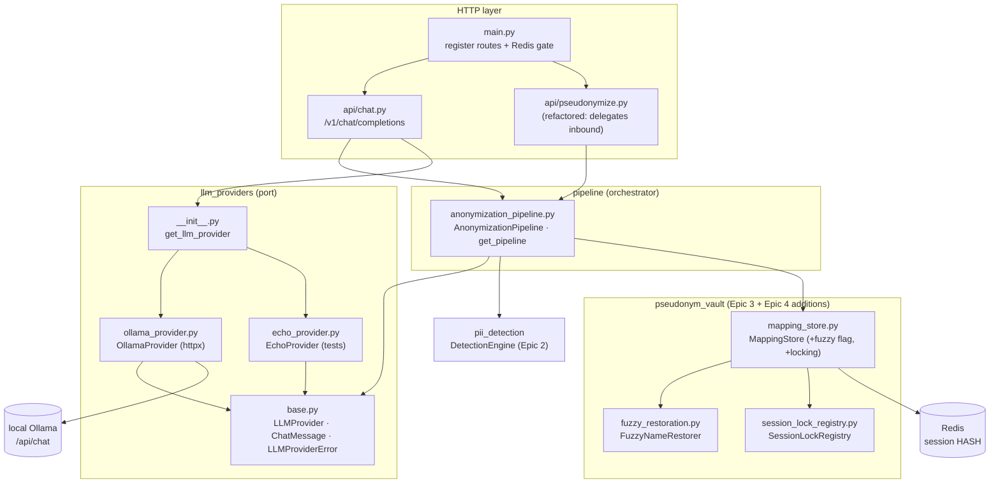
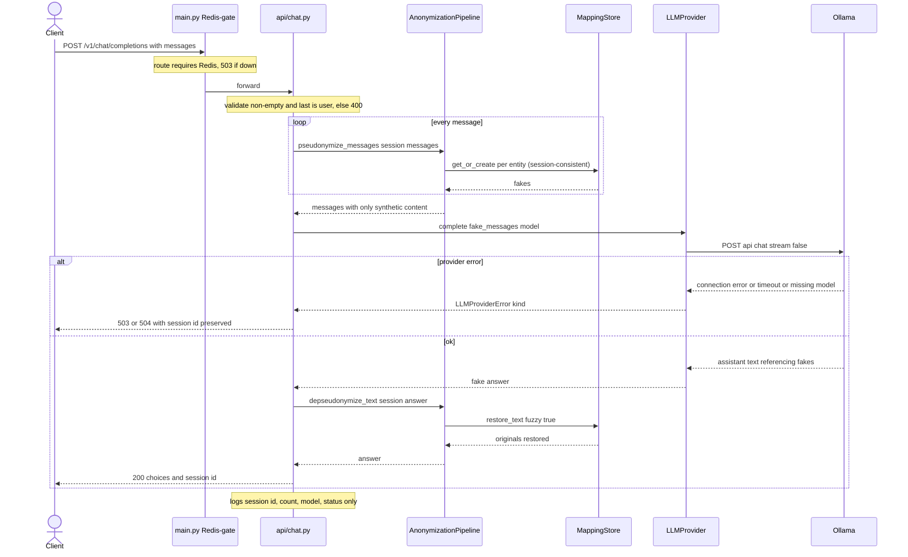

# ADR 0004 — Anonymization Pipeline & First End-to-End LLM Round-Trip (Epic 4)

- **Status:** Accepted
- **Date:** 2026-06-17
- **Deciders:** Project author (thesis), with the project constitution as the binding authority
- **Scope:** `apps/gateway-api` — the reusable **anonymization pipeline** (inbound/outbound orchestration), the **LLM provider port** + one real provider (local Ollama) + a network-free stub, the outbound **fuzzy restore fallback**, and the minimal **`POST /v1/chat/completions`** endpoint. Also: an opt-in **`dev/ollama/`** deployment add-on and a per-session **concurrency fix** in the vault.
- **Related:** `specs/005-anonymization-pipeline/` (spec, plan, research **D1–D11**, data-model, contracts, quickstart, tasks), constitution `.specify/memory/constitution.md` (**v1.1.0**), **ADR 0001** (Epic 2 detection), **ADR 0002** (Epic 3 substitution & reversible mapping — consumed here), **ADR 0003** (vault readability refactor)
- **Touches prior epics:** extends `pseudonym_vault/MappingStore` additively (`restore_text(fuzzy=…)`, per-session locking) and refactors the inline substitution out of `api/pseudonymize.py` into the shared pipeline — **without** changing Epic 3 behaviour, the Redis field layout, or the AES-256-GCM envelope.

---

## 1. Context

Epics 2 (ADR 0001) and 3 (ADR 0002) **detect** PII and **substitute** it with realistic, reversible,
session-consistent fakes — but only through two **debug** routes with **no LLM**, and the substitution
orchestration lived **inline** inside the debug handlers. Epic 4 is the **vertical slice** that, for the
first time, closes a full round-trip through a **real LLM**: pseudonymize the request, send it to the LLM,
de-pseudonymize the answer — proving the gateway works end to end while the provider only ever sees
synthetic data.

Constraints that shaped the design:

- **Stack is fixed** (constitution): Python 3.12 / FastAPI, async; **`httpx`** for the Ollama REST call
  (already a dependency — no new heavy dependency); reuse Epic 1 Redis + the availability gate.
- **Privacy by design** (Principle I): every request to the LLM passes through pseudonymization; there is
  **no passthrough**.
- **Provider agnosticism** (Principle IV): no component is coupled to a concrete provider; a new provider
  needs no pipeline change.
- **Synchronous only** (Principle V): the full answer is received before de-pseudonymization; **no
  streaming**.
- **No PII in logs** (Principle VIII); **Polish first** (Principle VI); **simplicity over completeness**
  with documented limitations (Principle IX).
- **Reuse, do not reimplement** Epic 2 detection and the Epic 3 generator + store; keep their public
  behaviour and wire formats frozen (the Epic 3 round-trip is the regression contract).

Out of scope (later epics): OpenAI/Anthropic adapters + a model-based provider router; the full chat
response contract (usage, `finish_reason` passthrough, anonymization metadata); logging/metrics
middleware; session GET/DELETE endpoints; streaming/SSE. The previously planned standalone
`POST /v1/anonymize` is **dropped** — `POST /v1/pseudonymize` (Epic 3) already serves it.

---

## 2. Decision (summary)

Two new internal packages, one additive vault change, one endpoint, and one opt-in deployment add-on:

- **`pipeline/`** — `AnonymizationPipeline`, the reusable, programmatically-callable orchestrator:
  `pseudonymize_text` (the inbound core **extracted** from `api/pseudonymize.py`), `pseudonymize_messages`
  (pseudonymize **every** message each turn), `depseudonymize_text` (exact + inflection, then fuzzy). It
  **composes** the reused `DetectionEngine` and `MappingStore` — it reimplements neither.
- **`llm_providers/`** — an abstract **`LLMProvider`** port (`complete(messages, *, model) -> str`,
  `health_check() -> bool`) + `ChatMessage` + `LLMProviderError(kind=…)`; one concrete **`OllamaProvider`**
  (REST, `stream=false`) and a deterministic, network-free **`EchoProvider`** for tests; a
  `get_llm_provider()` FastAPI dependency.
- **Outbound fuzzy fallback** — `pseudonym_vault/fuzzy_restoration.FuzzyNameRestorer`, reached via an
  **opt-in `restore_text(..., fuzzy=False)`** flag (default off → Epic 3 behaviour byte-identical).
- **`api/chat.py`** — `POST /v1/chat/completions` (OpenAI-compatible **shape**, minimal content), runs
  inbound → LLM → outbound; **Redis-gated** (not exempt).
- **`dev/ollama/`** — an **optional, opt-in** compose add-on that stands up a local Ollama; the core stack
  stays LLM-agnostic (the gateway connects to whatever `OLLAMA_BASE_URL` points at).
- **Concurrency fix** — a per-session `SessionLockRegistry` collaborator makes `MappingStore.get_or_create`
  race-safe (surfaced by Epic 4 stress testing).

---

## 3. How the system works

### 3.1 Inbound/outbound pipeline (reusable component, no HTTP dependency)

```text
INBOUND  pseudonymize_messages(session, messages)        # every message, every turn (FR-005)
   └─ for each message:  pseudonymize_text(session, content)
         ├─ DetectionEngine.detect(content)              # Epic 2
         ├─ for each entity: MappingStore.get_or_create(session, entity)   # Epic 3, session-consistent
         └─ splice fakes end→start (offsets stay valid)
      ⇒ messages with ONLY synthetic content  (deterministic: same original → same fake — FR-006)

OUTBOUND depseudonymize_text(session, answer)
   └─ MappingStore.restore_text(session, answer, fuzzy=True)
         ├─ exact + inflection pass   (Epic 3, unchanged)
         └─ fuzzy fallback over tokens the exact pass left  (PERSON/LOCATION only)
```

The client↔gateway hop is inside the trust boundary; only the gateway↔LLM hop is protected. The answer
returned to the client is de-pseudonymized for display, then re-pseudonymized on the next turn.

### 3.2 Chat round-trip — `POST /v1/chat/completions`

```text
{messages[], session_id?, model?} ─▶ Redis gate (503 if down)
   ─▶ validate: non-empty AND last role == "user"      → else 400 (before any LLM call)
   ─▶ session_id := request.session_id or uuid4().hex
   ─▶ model := request.model or settings.default_model
   ─▶ fake_messages = pipeline.pseudonymize_messages(session_id, messages)   # only fakes leave
   ─▶ fake_answer  = provider.complete(fake_messages, model=model)           # synchronous
   ─▶ answer       = pipeline.depseudonymize_text(session_id, fake_answer)   # originals restored
   ─▶ 200 {session_id, choices:[{index, message:{role:"assistant", content}, finish_reason:null}]}
        logs: session_id + message count + model + status only (never content)
```

**Error taxonomy** (each preserves `session_id`): malformed request → **400**; provider
`unreachable`/`missing_model` (or Redis down via the gate) → **503**; provider `timeout` → **504**.

### 3.3 Fuzzy restore fallback (`FuzzyNameRestorer`, frozen parameters)

Runs only after the exact + inflection pass, only on the tokens it left, over the **stored fake surface
forms** of PERSON/LOCATION mappings:

| Guard | Value |
|-------|-------|
| Entity scope | **allowlist `{PERSON, LOCATION}`** — everything else exact-only |
| Min token length | 4 |
| Prefix anchor | shared prefix ≥ **0.6 × len(shorter token)** — gates **before** distance |
| Distance gate | `bounded_levenshtein(token, candidate, max_distance=2)` is not None |
| Tie | two distinct originals equally close → **skip** (never guess) |
| Restored form | original in **base (nominative)** form, token-aligned (documented limitation) |

### 3.4 Provider port

```text
LLMProvider (abstract)         complete(messages, *, model) -> str   |  health_check() -> bool
  ├─ OllamaProvider            POST {OLLAMA_BASE_URL}/api/chat {model, messages, stream:false},
  │                            timeout=OLLAMA_TIMEOUT; reads message.content;
  │                            ConnectError→unreachable · 404/"model not found"→missing_model · ReadTimeout→timeout
  └─ EchoProvider              deterministic, network-free (echoes the last user message) — tests only
LLMProviderError(kind: "unreachable" | "missing_model" | "timeout")    # handler maps kind → 503/504
```

### 3.5 Layers & responsibilities (new/changed in Epic 4)

| Layer | Files | Responsibility |
|-------|-------|----------------|
| HTTP | `main.py`, `api/chat.py` | Register `/v1/chat/completions` (Redis-gated); validate (400); map provider errors (503/504); no-PII logging |
| Orchestration | `pipeline/anonymization_pipeline.py` | `pseudonymize_text`/`_messages`, `depseudonymize_text`; `get_pipeline()` factory; composes engine + store |
| Provider port | `llm_providers/{base,ollama_provider,echo_provider}.py`, `__init__.get_llm_provider` | Abstract `LLMProvider`; Ollama REST adapter; echo stub; error→kind |
| Outbound fuzzy | `pseudonym_vault/fuzzy_restoration.py` | `FuzzyNameRestorer` — bounded, prefix-anchored, PERSON/LOCATION-only base-form recovery |
| Vault (changed) | `pseudonym_vault/mapping_store.py` | `restore_text(fuzzy=…)`; per-session locking via `SessionLockRegistry` |
| Concurrency | `pseudonym_vault/session_lock_registry.py` | One `asyncio.Lock` per session (race-safety) |
| Epic 3 reuse | `api/pseudonymize.py` (refactored) | Delegates inbound to `pipeline.pseudonymize_text`; response unchanged |
| Config | `config.py` | `+ OLLAMA_TIMEOUT` (`ollama_base_url`/`default_model` already existed) |

---

## 4. Dependency & communication diagrams

### 4.1 Module dependency graph (who imports whom)



### 4.2 Request sequence — `POST /v1/chat/completions`



---

## 5. Why it works this way (rationale)

Each choice traces to a research decision (**D1–D11**), a constitution principle, or a finding from live
testing.

### 5.1 A reusable pipeline; extract the inbound, don't duplicate it (D8, FR-001/FR-003)
The inbound substitution that lived inline in `api/pseudonymize.py` is moved into
`AnonymizationPipeline.pseudonymize_text`; the debug handler now delegates to it (its response stays
byte-identical). One implementation backs both the debug endpoint and the chat endpoint, and the pipeline
is callable as a plain component (no HTTP), ready for later epics. Because `get_or_create` is already
session-consistent, applying it across the whole messages array yields deterministic re-pseudonymization
for free (FR-006) — no new mapping logic.

### 5.2 Pseudonymize **every** message, every turn (D8, FR-005, Principle I)
In chat mode the whole conversation is resent each turn, and earlier assistant messages were
de-pseudonymized for display — so they now carry original PII. The inbound stage therefore pseudonymizes
**every** message, not only the last, closing the leak path where an original re-enters through history.
This is the privacy-critical decision and is asserted in tests (the provider payload is captured and
checked for any original).

### 5.3 Abstract provider port; Ollama + echo stub (D5, D7, Principle IV/V)
The pipeline and endpoint depend only on `LLMProvider`; the concrete provider is injected. `complete`
returns plain assistant text (rich responses are a later epic); a single `LLMProviderError.kind` keeps the
error→HTTP mapping in one place. Ollama is called with `stream=false` (Principle V — full answer before
restore). The `EchoProvider` makes the whole round-trip deterministic and network-free in tests; the chat
tests override the dependency with a recording stub.

### 5.4 Fuzzy fallback: allowlist, stored-forms, prefix anchor, base form (D2–D4, FR-008–FR-015)
A real LLM sometimes renders a fake PERSON/LOCATION in an inflected form the suffix table never produced.
The fuzzy pass recovers it, but conservatively: it is an **allowlist** of `{PERSON, LOCATION}` (so
identifiers/e-mail/phone/date are exact-only — a one-character edit on a PESEL is a different valid
number); it matches against the **stored fake surface forms** (not just the base), so `max_distance=2`
stays realistic for oblique cases; a **prefix anchor** (≥ 0.6 of the shorter token) gates before the
distance check because Polish inflection changes the suffix, not the stem; ties are skipped; and on a hit
the original is restored in **base form** (a documented limitation — identity correct, grammar maybe off).
The prefix anchor is what prevents an invented name from being "restored".

### 5.5 Fuzzy is opt-in on `restore_text`; Epic 3 stays frozen (D1, regression contract)
The fuzzy algorithm lives in the vault (next to `reverse_records`, `bounded_levenshtein`,
`OriginalSurfaceRestorer`), reached via an additive `restore_text(..., fuzzy=False)` parameter. Default
`False` keeps `/v1/depseudonymize` and every Epic 3 test byte-identical; only the pipeline's outbound
stage passes `fuzzy=True`. Putting fuzzy entirely in the pipeline was rejected: it would re-implement
tokenization that belongs with the exact pass and would force the caller to know which store operations
are mutating.

### 5.6 Chat endpoint: minimal, Redis-gated, validate before the LLM (D6, D9, FR-020–FR-023)
The endpoint is OpenAI-compatible in **shape** (a `choices` array) but minimal in **content** (the full
contract is deferred). It reuses the Epic 1 Redis gate unchanged (it needs the store, so it is **not**
exempt). Validation that needs no LLM (empty array / non-user last message) returns **400 before** any
provider call. Provider failures map to **503** (unreachable/missing model) / **504** (timeout) with a
readable message and the `session_id` preserved so the caller can retry.

### 5.7 The LLM backend is config, not part of the core stack (D11, Principle IV)
The core `docker-compose.yml` bundles **no** model server; the gateway connects to whatever
`OLLAMA_BASE_URL` (or, later, hosted-API keys) points at. A self-hosted Ollama is an **opt-in** add-on at
`dev/ollama/docker-compose.ollama.yml`, used additively. One env var gives three modes (native
`localhost`, core-compose `host.docker.internal`, add-on `ollama` service name), mirroring the existing
`REDIS_URL` split. In real production the operator supplies the endpoint; bundling a GB-sized, GPU-bound
model server into the core stack is heavy and, on macOS, CPU-only (Docker has no Metal). A small CA hook
(`OLLAMA_CA_FILE`/`OLLAMA_SSL_CERT_FILE`, default no-op) lets the container pull models behind a
TLS-inspecting proxy.

### 5.8 Per-session locking makes `get_or_create` race-safe (test-driven; FR-012)
A live concurrency stress test (50 simultaneous same-session requests for the same original) exposed a
**read-then-write race**: `get_or_create` does `await read_forward` … `await write_mapping`, and under
async concurrency many coroutines read "no mapping" before the first write lands, so each mints its own
fake — yielding multiple fakes for one original (observed 6 PERSON, 3 PESEL). This **never leaked PII**
(every value was still substituted) but broke same-original→same-fake **consistency**. Fix: a
**`SessionLockRegistry`** collaborator hands the store one `asyncio.Lock` per session; `get_or_create`
serializes its critical section per session while different sessions stay parallel. The store **owns** the
synchronization (it owns the invariant and is the process-wide singleton; the pipeline is per-request and
cannot hold shared lock state), but delegates the **mechanism** to the injected registry — consistent with
how it uses its other collaborators. In-process locking is correct for the single-worker gateway; a
multi-process deployment would need a Redis-level lock (documented limitation, Principle IX).

---

## 6. Consequences

**Positive**
- **First proven end-to-end round-trip through a real LLM:** verified live on a 1.4 k-char Polish lease
  contract (33 entities / 9 types substituted, originals restored in the answer) and across a multi-turn
  conversation — the provider only ever received synthetic data; no original PII in logs.
- The pipeline is a plain reusable component; adding a provider needs **no** pipeline change (Principle IV).
- Fuzzy fallback recovers unforeseen inflected fake names safely; identifiers are never fuzzed; invented
  names are left untouched.
- Epic 3 is **untouched** in behaviour and wire format (regression contract held: the `/v1/pseudonymize` +
  `/v1/depseudonymize` round-trip and all prior tests stay green).
- `get_or_create` is now **race-safe** per session, with a focused regression test.
- Test suite: **187 tests**, fully **network-free** (echo/stub provider + `fakeredis`).

**Negative / limitations** (documented per Principle IX, see `apps/gateway-api/README.md`)
- A fuzzy hit restores the **base (nominative)** form — identity is correct even if the surrounding grammar
  is slightly off (seen live: cities returning as *Wrocław/Szczecin* instead of *Wrocławiu/Szczecinie* when
  the model rewrote the inflection).
- Restore quality depends on the model echoing fakes faithfully; a too-small model (e.g. `llama3.2:1b`)
  mangles them. `qwen2.5:3b` is the recommended local default.
- Per-session locking is **in-process** — a multi-worker deployment would reintroduce the race and needs a
  Redis-level lock.
- On macOS, an in-container Ollama is **CPU-only** (slow); the host-native + `host.docker.internal` path is
  recommended for a fast demo.
- Entity coverage is inherited from Epic 2: e.g. an ID-card number ("dowód osobisty") has no recognizer, so
  it is **not** masked (a known gap, not a regression).

---

## 7. Alternatives considered

| Alternative | Rejected because |
|-------------|------------------|
| Leave the inbound substitution inline in the debug handler and re-implement it for chat | Duplicated, drift-prone logic; FR-003 mandates one shared implementation (the pipeline). |
| Always-on fuzzy in `restore_text` | Would change `/v1/depseudonymize` output for look-alike inputs — breaks the Epic 3 regression contract. Opt-in `fuzzy=True` keeps it byte-identical by default. |
| Fuzzy entirely inside the pipeline (not the vault) | Re-implements tokenization that belongs with the exact pass; needs new store surface to expose name records; worse cohesion. |
| Match fuzzy candidates against the nominative base only | Common Polish oblique forms are > 2 edits from the base, forcing a larger distance that starts matching genuinely different names. Matching against stored case forms keeps distance ≤ 2 safe. |
| Bake Ollama into the core `docker-compose.yml` (or a profile) | Forces a heavy, opinionated, GPU-less-on-macOS dependency on every deploy. A separate opt-in `dev/ollama/` file signals "optional, not production" and keeps the core stack LLM-agnostic. |
| Move per-session locking to the caller/pipeline | The pipeline is created **per request**, so a registry there would not be shared across requests → no serialization; and it would leak which store ops are unsafe under concurrency. The store owns the invariant, so it owns the synchronization. |
| Streaming/SSE for the chat answer | Partial responses cannot be safely de-pseudonymized (Principle V). Synchronous only. |

---

## 8. References

- Spec & design: `specs/005-anonymization-pipeline/{spec,plan,research,data-model,quickstart}.md`,
  `contracts/` (chat-endpoint, llm-provider-port, anonymization-pipeline)
- Constitution **v1.1.0**: `.specify/memory/constitution.md` (Principles I, IV, V, VI, VIII, IX)
- Code: `apps/gateway-api/gateway_api/pipeline/`, `gateway_api/llm_providers/`,
  `gateway_api/pseudonym_vault/{fuzzy_restoration,session_lock_registry}.py`, `gateway_api/api/chat.py`;
  changed `gateway_api/pseudonym_vault/mapping_store.py`, `gateway_api/api/pseudonymize.py`, `config.py`,
  `main.py`
- Deployment add-on: `dev/ollama/{docker-compose.ollama.yml,pull-model.sh,README.md}`;
  agent guide `.claude/rules/local-llm-ollama.md`
- Prior art: **ADR 0001** (Epic 2 detection), **ADR 0002** (Epic 3 substitution & mapping — consumed here),
  **ADR 0003** (vault readability refactor)
- Manual validation: `postman/PW Masters — Secure Gateway API.postman_collection.json` (folder "Chat (Epic 4)")
```
