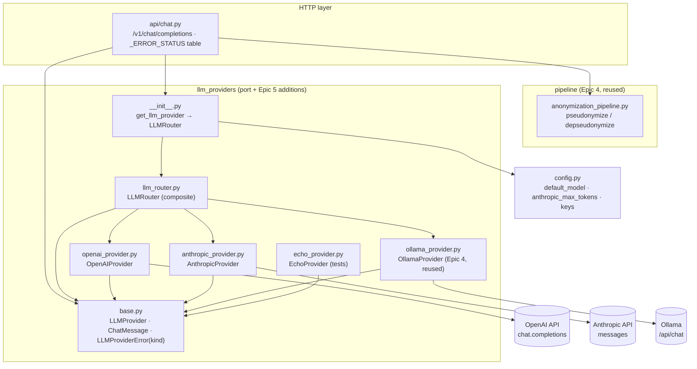
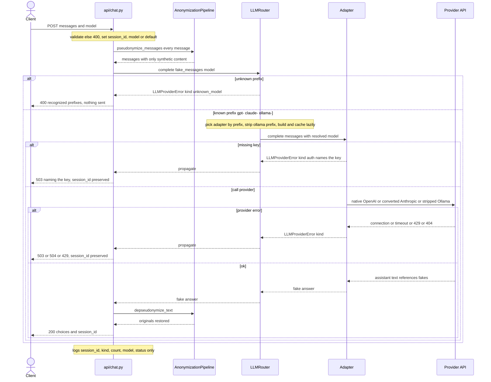

# ADR 0005 — Provider Adapters (Provider-Agnostic) & a Model-Based Router (Epic 5)

- **Status:** Accepted
- **Date:** 2026-06-17
- **Deciders:** Project author (thesis), with the project constitution as the binding authority
- **Scope:** `apps/gateway-api` — two new LLM adapters behind the Epic 4 provider port (**OpenAI**, **Anthropic**), the explicit reuse of the **Ollama** adapter, a model-based **`LLMRouter`** (a composite `LLMProvider`), an extended & centralized **provider-error taxonomy**, and the configuration/doc alignment the routing change requires.
- **Related:** `specs/006-provider-adapters-router/` (spec, plan, research **D1–D12**, data-model, contracts, quickstart, tasks), constitution `.specify/memory/constitution.md` (**v1.1.0**), **ADR 0004** (Epic 4 — the pipeline + provider port this epic generalizes), **ADR 0002/0003** (Epic 3 substitution & vault — reused, frozen)
- **Touches prior epics:** **reuses** the Epic 4 pipeline, chat endpoint, Ollama adapter, and provider port **unchanged**; the only edits to prior code are **additive** — `ProviderErrorKind` gains three kinds, `api/chat.py` swaps an inline ternary for a single `kind → HTTP` table, `config.py`/`main.py` drop the now-unused default-provider setting. Epic 2/3 behaviour, the Redis field layout, and the AES-256-GCM envelope are **frozen**.

---

## 1. Context

Epic 4 (ADR 0004) closed the first end-to-end round-trip through a real LLM, but only against **one**
provider (local Ollama), wired in directly: `get_llm_provider()` returned `OllamaProvider`
unconditionally and **ignored the requested model**. Provider agnosticism is a core principle
(Principle IV), so the gateway must support **more than one** real provider and choose between them
**per request**, through one stable interface — without the pipeline or the chat endpoint ever knowing
which concrete provider is in play.

Constraints that shaped the design:

- **Stack is fixed** (constitution): Python 3.12 / FastAPI, async. **New** dependencies: the official
  `openai` and `anthropic` Python SDKs (their **async** clients). `httpx` stays the transport for the
  reused Ollama adapter (no SDK there). No other new heavy dependency.
- **Provider agnosticism** (Principle IV): no component outside the adapters knows a concrete provider; a
  new provider is an adapter + config change only — **no** pipeline/endpoint change.
- **Privacy by design** (Principle I) & **no PII in logs** (Principle VIII): the whole-history
  pseudonymization guarantee holds for **every** provider; only synthetic data leaves the gateway.
- **Synchronous only** (Principle V): every adapter calls its provider non-streaming; the full answer is
  received before de-pseudonymization.
- **Simplicity over completeness** (Principle IX): routing by **prefix only** (no model-name registry);
  **no retries/backoff**; minimal text-only response retained.
- **Reuse, do not reimplement**: the Epic 4 `LLMProvider` port, `ChatMessage`, and `OllamaProvider` are
  reused as-is (the Epic 4 chat round-trip is the regression contract).

Out of scope (later epics / deliberate non-goals): streaming/SSE; the full chat response contract (usage,
`finish_reason` passthrough, anonymization metadata); a per-provider `/health` endpoint; session
GET/DELETE endpoints; a per-provider allowlist of valid model **names** (routing is by prefix); automatic
retries or backoff on provider errors.

---

## 2. Decision (summary)

Three new modules in `llm_providers/`, two additive edits to prior code, and config/doc alignment:

- **`openai_provider.py`** — `OpenAIProvider(LLMProvider)` over `openai.AsyncOpenAI`. Serves `gpt-`
  models. OpenAI is the system's **native** message shape → **no conversion**; a `system` message is
  passed through as the first message. A length-truncated answer (`finish_reason == "length"`) logs a
  warning and **still returns the partial content**; a deprecated/unknown model surfaces the provider's
  own error.
- **`anthropic_provider.py`** — `AnthropicProvider(LLMProvider)` over `anthropic.AsyncAnthropic`. Serves
  `claude-` models. **Converts** the OpenAI-shaped messages to Anthropic's contract: system content
  lifted to the top-level `system` field (concatenated; omitted when none); consecutive same-role turns
  merged so the history begins with a user turn and alternates; an explicit `max_tokens` from config on
  every call.
- **`llm_router.py`** — `LLMRouter(LLMProvider)`, a **composite**: the chat endpoint keeps calling **one**
  provider; the router dispatches per request by the model **prefix** (`gpt-`→OpenAI, `claude-`→Anthropic,
  `ollama/`→Ollama with the prefix **stripped**). An unrecognized prefix raises `unknown_model` (→ 400)
  before any adapter is touched. It holds **lazily-built, cached** per-prefix adapters.
- **`base.py` (additive)** — `ProviderErrorKind` extended with `rate_limit`, `auth`, `unknown_model`. The
  `LLMProvider`/`ChatMessage`/`LLMProviderError` shapes are otherwise unchanged (Principle IV / FR-001).
- **`api/chat.py` (additive)** — a single module-level `_ERROR_STATUS` table is the one place that maps
  every error kind to its HTTP status, replacing Epic 4's inline ternary.
- **`__init__.get_llm_provider`** — now builds and returns the `LLMRouter` (replacing the hardcoded
  `OllamaProvider`); kept `@lru_cache`, so the router and its adapter/client instances are a process
  singleton (connection pooling). Tests override this dependency to bypass the router.
- **Config & docs** — `config.py`: **remove** `default_llm_provider`, **change** `default_model` to
  `ollama/qwen2.5:3b` (keyless offline default), **add** `anthropic_max_tokens`. `main.py` startup log
  drops the removed field. `.env`/`.env.example`, the Postman "Chat" folder, the `dev/ollama/` docs, and
  `pull-model.sh` move to **prefixed** Ollama model names.

---

## 3. How the system works

### 3.1 Model-based routing (the router IS the provider the endpoint calls)

```text
endpoint:  model := request.model or settings.default_model      # Epic 4 line, UNCHANGED
           provider := get_llm_provider()                        # now an LLMRouter
           provider.complete(fake_messages, model=model)

LLMRouter.complete(messages, *, model):
   prefix match (by insertion order):
     "gpt-"     -> OpenAIProvider     (model unchanged)
     "claude-"  -> AnthropicProvider  (model unchanged)
     "ollama/"  -> OllamaProvider     (model[len("ollama/"):]  ← prefix stripped)
     else       -> raise LLMProviderError(kind="unknown_model",
                          "Unknown model '<m>'. Recognized prefixes: gpt-, claude-, ollama/")
   adapter built lazily on first use and cached (keys optional at startup)
```

The endpoint resolves the default model (Epic 4 behaviour); the router is pure prefix dispatch. "No model
→ default → routed by prefix" therefore needs no endpoint change — only the default **value** moved to an
`ollama/` model so the keyless, offline demo works out of the box.

### 3.2 Anthropic message conversion (OpenAI-shaped → Anthropic contract)

```text
[system "A", system "B", user "u1", user "u2", assistant "a1"]
        │
        ├─ system  := "A\n\nB"                    (lifted; concatenated; omitted if none)
        └─ messages:= [ {user: "u1\n\nu2"},       (consecutive same-role merged with \n\n)
                        {assistant: "a1"} ]        (begins with user, alternates)
   call: client.messages.create(model, max_tokens=<config>, messages=…[, system=…])
   reply: "".join(block.text for block in response.content if block.type == "text")
```

### 3.3 Extended, centralized error taxonomy (one `kind → HTTP` table in `api/chat.py`)

| `kind` | HTTP | Source | Retry? |
|--------|------|--------|--------|
| `unreachable` | **503** | connection failure (Ollama; SDK `APIConnectionError`) | no |
| `missing_model` | **503** | model not found (Ollama 404; SDK `NotFoundError`, incl. deprecated models) | no |
| `timeout` | **504** | exceeded timeout (`OLLAMA_TIMEOUT`; SDK `APITimeoutError`) | no |
| `rate_limit` | **429** | upstream 429 (SDK `RateLimitError`) | **no** |
| `auth` | **503** | missing/invalid API key — message **names** the key | no |
| `unknown_model` | **400** | router found no matching prefix — nothing sent to any provider | n/a |

Every error response preserves `session_id`; logs carry `session_id` + `kind`/model/counts/status only,
never content, originals, fakes, or key **values**. Adapters build their SDK client with `max_retries=0`
— the rate-limit signal reaches the client unchanged, no silent retry.

### 3.4 Provider port (reused; only the error enum is extended)

```text
LLMProvider (abstract, base.py)   complete(messages, *, model) -> str  |  health_check() -> bool
  ├─ OpenAIProvider      AsyncOpenAI(max_retries=0); native shape (no conversion); length→warn+partial
  ├─ AnthropicProvider   AsyncAnthropic(max_retries=0); (system,messages) conversion; max_tokens from config
  ├─ OllamaProvider      Epic 4, REUSED unchanged; reached only via the router's "ollama/" branch (stripped)
  ├─ EchoProvider        Epic 4, REUSED for tests
  └─ LLMRouter           composite — dispatches by model prefix; health_check → default model's provider
ProviderErrorKind = unreachable | missing_model | timeout | rate_limit | auth | unknown_model
```

### 3.5 Layers & responsibilities (new/changed in Epic 5)

| Layer | Files | Responsibility |
|-------|-------|----------------|
| Provider port (changed) | `llm_providers/base.py` | `ProviderErrorKind` += `rate_limit`/`auth`/`unknown_model` (additive) |
| Adapters (new) | `llm_providers/openai_provider.py`, `anthropic_provider.py` | OpenAI native pass-through + truncation; Anthropic conversion + `max_tokens`; SDK-exception → kind; lazy client, no retry |
| Router (new) | `llm_providers/llm_router.py` | Prefix dispatch; `ollama/` strip; `unknown_model`; lazy/cached adapters; `health_check` delegation |
| Wiring (changed) | `llm_providers/__init__.py` | `get_llm_provider()` builds & returns the `LLMRouter` |
| HTTP (changed) | `api/chat.py` | Single `_ERROR_STATUS` table (kind → 503/504/429/503/400); `session_id` preserved; content-free logs |
| Config (changed) | `config.py`, `main.py` | − `default_llm_provider`; `default_model = ollama/qwen2.5:3b`; + `anthropic_max_tokens`; startup log fix |
| Ollama (reused) | `llm_providers/ollama_provider.py` | **Unchanged**; now selected explicitly via `ollama/` (stripped) |

---

## 4. Dependency & communication diagrams

### 4.1 Module dependency graph (who imports whom)



### 4.2 Request sequence — routing per model (`POST /v1/chat/completions`)



---

## 5. Why it works this way (rationale)

Each choice traces to a research decision (**D1–D12**), a constitution principle, or the regression
contract.

### 5.1 Official async SDKs, `max_retries=0` (D1, FR-020, Principle V)
The official `openai`/`anthropic` clients give typed exceptions (connection/timeout/rate-limit/auth/
not-found) that map cleanly to the error taxonomy, and their **async** clients fit the port's
`async complete`. The single most important non-default is **`max_retries=0`**: both SDKs default to
`max_retries=2`, which would silently retry a 429 and contradict FR-020. `httpx` stays the Ollama
transport (no first-party SDK in scope) — no churn to the reused adapter.

### 5.2 The port is reused unchanged; the router resolves nothing it doesn't have to (D2, FR-001/FR-018, Principle IV)
`LLMRouter` is itself an `LLMProvider`, so the chat endpoint keeps calling **one** provider and is wholly
unaware of prefixes or concrete providers. The endpoint's Epic 4 line `request.model or default_model` is
**unchanged**, so `complete(*, model: str)` — i.e. the port — is byte-identical (FR-001); the router only
needs `default_model` for `health_check`. A **factory registry** (prefix → callable) makes the router
trivially testable with injected doubles and keeps adapters **lazy** (D8).

### 5.3 Prefix routing only; Ollama is not a catch-all (D3, FR-014/FR-015, Principle IX)
Routing is by **prefix** — `gpt-`, `claude-`, `ollama/` — with no registry of valid model names. The only
namespaced prefix (`ollama/`) is **stripped** before the name reaches the reused Ollama adapter, so that
adapter is untouched. An unrecognized model is the **caller's** mistake → **400** listing the recognized
prefixes, raised before any provider call. Treating Ollama as a default for unknown models was rejected as
a silent provider assumption.

### 5.4 OpenAI native pass-through; Anthropic conversion (D4, D5, FR-004–FR-010)
OpenAI's shape is the system's native shape, so the OpenAI adapter performs **no** conversion (a `system`
message stays first), logs a warning and returns the **partial** content on `finish_reason == "length"`,
and surfaces the provider's own error for a deprecated/unknown model. Anthropic's rules differ, so the
Anthropic adapter lifts `system` into the top-level field (concatenated; omitted when empty), **merges**
consecutive same-role turns so the history is user-first and alternating, and passes an explicit
`max_tokens` from config on every call. A history whose first non-system turn is an *assistant* turn is
atypical here and is left to surface Anthropic's own error (a documented limitation, Principle IX).

### 5.5 One centralized error table; `unknown_model` flows through the same channel (D6, D7, FR-019/FR-023)
The mapping from error kind to HTTP status lives in **one** place — a `_ERROR_STATUS` dict in
`api/chat.py`. Because the router is itself a provider, its `unknown_model` is raised as an
`LLMProviderError` and flows through the **same** `except LLMProviderError` the endpoint already had — no
second exception type and no second map. A separate `RoutingError`/`HTTPException` was rejected for
splitting the mapping across two places. Pseudonymization may run before the router discovers an unknown
model, but that is internal and network-free — "nothing is sent to any provider" still holds.

### 5.6 Lazy, cached clients; keys optional at startup (D8, FR-021/FR-022)
The router builds each adapter on first use and caches it; each hosted adapter builds its SDK client
lazily **only when its key is present**. A missing key raises `auth` (→ 503) **at request time**, naming
the variable (`OPENAI_API_KEY` / `ANTHROPIC_API_KEY`) — never a value — so the process **starts** with no
keys (the keyless offline demo) and only the route that needs a key fails. `get_llm_provider` keeps
`@lru_cache`, so the router (and its cached clients) is a process singleton → connection pooling for free.

### 5.7 One source of truth for selection: the default model (D9, FR-016/FR-017)
Selection is entirely by model prefix, so the Epic 4 `default_llm_provider` setting is **removed**
(its removal forced the one-line `main.py` startup-log fix). `default_model` becomes the single lever; it
moves to `ollama/qwen2.5:3b` so a no-model, keyless request routes to local Ollama out of the box.
`anthropic_max_tokens` is added (required by the Anthropic API). Because the `ollama/` prefix is now
mandatory, the Postman "Chat" folder and the `dev/ollama/` docs move to prefixed names, and
`pull-model.sh` strips the prefix before `ollama pull` (a bare name now 400s as an unknown model).

### 5.8 Everything verified offline by mocking the SDK, not the network (D12, FR-027/SC-009)
All new tests run network-free with **no keys**: the router with injected recording adapters; each
adapter with its `AsyncOpenAI`/`AsyncAnthropic` class monkeypatched to an async fake (asserting
conversion, `max_tokens`, exception→kind, no-retry, and missing-key→auth-without-building-a-client); and
the endpoint with failing/recording doubles for the 429/503/400 paths and the no-PII assertion. A
dedicated **integration** test drives the **real** `OpenAIProvider`/`AnthropicProvider` classes through
`/v1/chat/completions` with only the SDK client mocked — proving the providers are correctly wired,
Anthropic's conversion runs, and the pipeline round-trip restores the originals while the provider sees
only synthetic data.

---

## 6. Consequences

**Positive**
- **Provider agnosticism is real:** three interchangeable providers behind one unchanged port, chosen
  per request; adding/swapping a provider is an adapter + config change with **no** pipeline/endpoint
  change (Principle IV).
- The Epic 4 chat round-trip is **untouched** and flows through the router transparently (the default
  `ollama/qwen2.5:3b` routes to the reused Ollama adapter); the keyless offline demo still works.
- Trustworthy failure behaviour: a rate limit is a clean **429** with no silent retry; a missing key is a
  **503 naming the key**; an unknown model is a **400** that touches no provider — all single-sourced.
- The whole-history pseudonymization guarantee holds for **every** provider; no original PII in logs or in
  any outgoing request (asserted on the routed path).
- Test suite: **226 tests**, fully **network-free** (mocked SDKs + echo/recording doubles + `fakeredis`);
  Epic 2/3/4 behaviour and the Redis/AES-256-GCM wire formats frozen.

**Negative / limitations** (documented per Principle IX)
- **No live hosted round-trip is exercised in CI** — hosted providers need a paid API key from the Console
  (a Max subscription does **not** grant API access). The adapters are proven against mocked SDKs; a real
  OpenAI/Anthropic call is a manual, keyed step (`quickstart.md` §2b).
- Routing is **by prefix only** — a model with a recognized prefix that the provider doesn't actually
  offer (e.g. a deprecated `gpt-…`) reaches the provider and surfaces its own error, rather than being
  rejected up front. This is deliberate (no model-name registry).
- **No retries/backoff** on any provider error — by design; a transient 429/503 is returned to the caller
  as-is.
- The Anthropic adapter restores identity but its conversion assumes a **user-first** history (after the
  system lift); a leading-assistant turn is left to the provider's own error.
- `get_llm_provider` is a process singleton (`@lru_cache`); a config change (keys, default model) requires
  a process restart to take effect — acceptable for the single-worker thesis gateway.

---

## 7. Alternatives considered

| Alternative | Rejected because |
|-------------|------------------|
| Keep Ollama as the default for unknown models | A silent provider assumption; FR-015 makes an unrecognized model an explicit **400** client error. |
| A separate `RoutingError` / raise `HTTPException` for unknown model | Splits the error→HTTP mapping across two places; reusing `LLMProviderError(kind="unknown_model")` keeps it in the single `_ERROR_STATUS` table (FR-023). |
| Pre-validate the model prefix in the handler before `complete` | Leaks the routing table (prefixes) into the endpoint, coupling it to providers. The router owns routing; the endpoint stays provider-agnostic. |
| Eagerly construct all adapters/clients in `get_llm_provider` | Would build hosted clients (and touch keys) for providers a deployment never uses, breaking "keys optional at startup". Lazy + cached is the contract. |
| Leave SDK `max_retries` at its default (2) | Silently retries 429s, contradicting FR-020. Build clients with `max_retries=0`. |
| Keep `default_llm_provider` for back-compat | Dead config that contradicts "the model is the single source of truth" and confuses operators. Removed. |
| Add a per-provider model-name allowlist | Out of scope (Principle IX); prefix routing + the provider's own error is sufficient for the thesis. |
| Hit real provider sandboxes in CI | Needs keys + network, violating FR-027. Mock the SDK's typed exceptions instead. |
| Streaming/SSE for hosted providers | Partial responses cannot be safely de-pseudonymized (Principle V). Synchronous only. |

---

## 8. References

- Spec & design: `specs/006-provider-adapters-router/{spec,plan,research,data-model,quickstart}.md`,
  `contracts/` (llm-router, openai-adapter, anthropic-adapter, error-taxonomy)
- Constitution **v1.1.0**: `.specify/memory/constitution.md` (Principles I, IV, V, VI, VIII, IX)
- Code (new): `apps/gateway-api/gateway_api/llm_providers/{openai_provider,anthropic_provider,llm_router}.py`
- Code (changed, additive): `gateway_api/llm_providers/{base,__init__}.py`, `gateway_api/api/chat.py`,
  `gateway_api/config.py`, `gateway_api/main.py`
- Tests: `apps/gateway-api/tests/llm_providers/{test_openai_provider,test_anthropic_provider,test_llm_router,test_provider_integration_mocked}.py`,
  extended `tests/test_chat_api.py`
- Config & docs: `.env.example`, `docker-compose.yml` (verified `extra_hosts`),
  `postman/PW Masters — Secure Gateway API.postman_collection.json` (folder "Chat"),
  `dev/ollama/{README.md,pull-model.sh}`, `.claude/rules/local-llm-ollama.md`
- Prior art: **ADR 0004** (Epic 4 — pipeline + provider port, generalized here), **ADR 0002/0003**
  (Epic 3 substitution & vault — reused, frozen)
- Manual validation: `specs/006-provider-adapters-router/quickstart.md` (offline mocked + live keyed)
```
